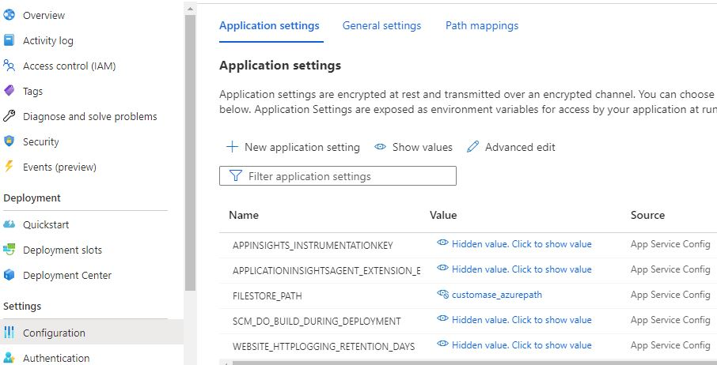

# FastAPI Python app deployment to Azure App Service

This sample shows how to deploy FastAPI Python app to Azure App Service.

Key highlights of this sample:
1. The FastAPI app is in main.py (now in app.py)
2. The required Python modules are in the vendor directory as .whl (wheel)
3. Depenency requirements are captured in requirements.txt (as usual)
4. Environment variables are used. Custom variables declared in .env file and loaded using python-dotenv lib. These variables can be changed at deployment time using app service settings.

## Run the code locally

1. Clone this repo. 
2. Switch to the repo directory and run `"pip install -r requirements.txt"` to get required dependencies installed locally
3. Run `"uvicorn main:app"` (or uvicorn app:app when it's in app.py)
4. Open browser and go to `"http://localhost:8000"` and you should get a "Hello World FastAPI" message back.
5. You can also get to API swagger doc at `"http://localhost:8000/docs"`

## Deploy python app to Azure App Service - Via VS Code
You can deploy your FastAPI Python app using VS Code and the Azure App Service extension. Follow instructions [Deploy your Python web app to Azure App Service on Linux](https://docs.microsoft.com/en-us/azure/developer/python/tutorial-deploy-app-service-on-linux-05) that explains how to deploy any Python app to Azure App Service. 

1. To deploy your FastAPI in main.py (or app.py) to Azure App Service, select the "fastapi-appservice-python" as the root folder when prompted in the VS code. You can either have VS Code create new App Service plan OR you can deploy your app to an existing app service/plan.
2. Once deployment is completed, your app will still not work as expected until you make the below change.
3. Open the App Service that you have deployed your FastAPI app to. Under `"Settings -> Configuration"` open tab `General Settings` of App Service
Give the Startup Command with the command to start FastAPI on Azure App Service. If your app is in app.py (vs main.py then it would be app:app below)

`"gunicorn -w 4 -k uvicorn.workers.UvicornWorker main:app"`

4. Restart your app service
5. Open browser and go to `"https://<appservicename>.azurewebsites.net"` and you should get a "Hello World FastAPI" message back.
6. You can also get to API swagger doc at `"https://<appservicename>.azurewebsites.net/docs"`

## Deploy python app to Azure App Service - Via CLI (Zip Deploy)
Applications can be deployed to Azure by creating and uploading a ZIP file of the application code to Azure. ZIP files can be uploaded to Azure using the Azure CLI or an HTTP client like cURL.

1. Create Azure App Service Web App – Via CLI or Azure Portal
Follow detailed instructions [here](https://docs.microsoft.com/en-us/azure/app-service/quickstart-python?tabs=flask%2Cwindows%2Cazure-portal%2Cterminal-bash%2Czip-deploy%2Cdeploy-instructions-azportal%2Cdeploy-instructions-zip-azcli#2---create-a-web-app-in-azure).

2. Enable build automation for Zip Deployment (**very important**)
When deploying a ZIP file of your Python code, you need to set a flag to enable Azure build automation. The build automation will install any necessary requirements and package the application to run on Azure.
Build automation in Azure is enabled by setting the **SCM_DO_BUILD_DURING_DEPLOYMENT** app setting in either the Azure portal or Azure CLI.

Via CLI: az webapp config appsettings set --resource-group rgname --name appname  --settings SCM_DO_BUILD_DURING_DEPLOYMENT=true

3. Deploy application code to Azure App Service
Zip up code, required .whl files, .py file, app dependencies and requirements.txt. Deploy Zip file via Azure CLI.
Example: az webapp deploy --name appname  --resource-group rgname --src-path fastapi-python.zip

4. Customize Startup Command:
Via CLI: az webapp config set --startup-file="gunicorn -w 4 -k uvicorn.workers.UvicornWorker app:app" --name appname  --resource-group rgname

Via Portal: Open the App Service that you have deployed your FastAPI app to. Under "Settings -> Configuration" open tab General Settings of App Service Give the Startup Command with the command to start FastAPI on Azure App Service. "gunicorn -w 4 -k uvicorn.workers.UvicornWorker main:app"

5. Restart App. App Service doesn’t pick up the startup changes automatically, so you’ll need to restart the WebApp
Via CLI: az webapp restart --name appname  --resource-group rgname

### Note on deployment via VS Code

The VS code Azure plugin is using [Oryx](https://github.com/Microsoft/Oryx) for python app deployment.

Oryx is a build system which automatically compiles source code repos into runnable artifacts. It is used to build web apps for Azure App Service and other platforms.

### Note on changing application variables (environment variables)

You can specify variable values (that might change environment to environment) using the [app settings](https://docs.microsoft.com/en-us/azure/app-service/configure-language-python#access-app-settings-as-environment-variables).

Below is an example of specifying custom value for variable FILESTORE_PATH which is declared in .env file within the Python project. You can either use the default value that's in the .env file or override it at deployment time by going to Configuration -> App settings as shown in the image below.

